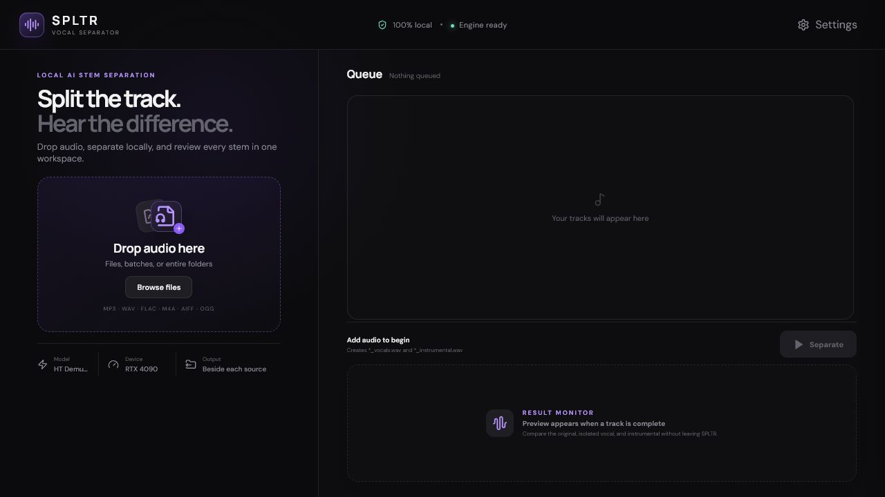
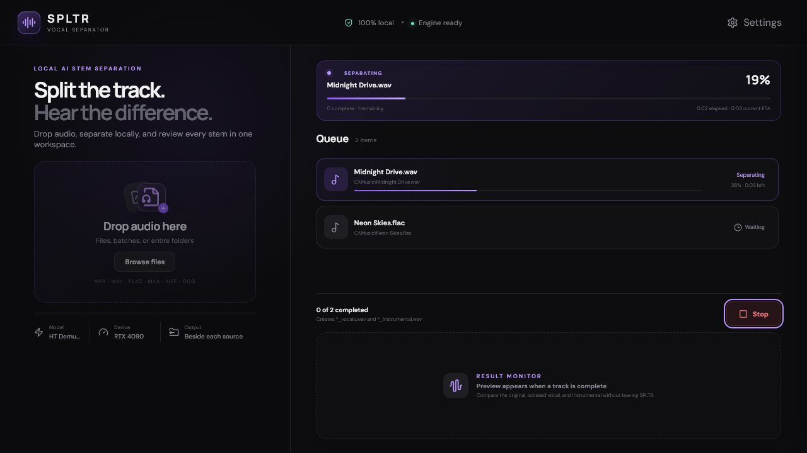
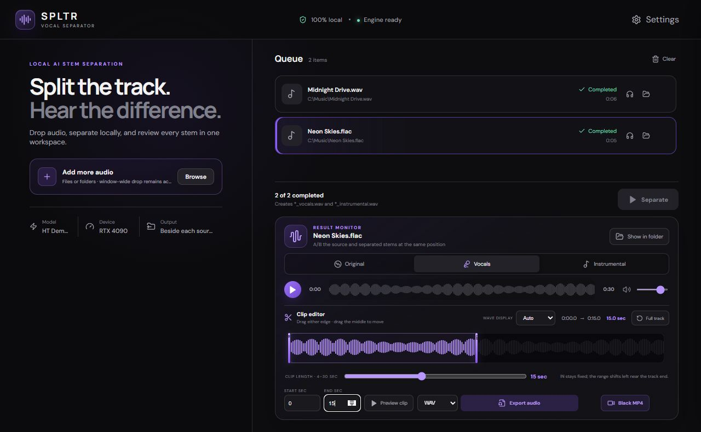

# SPLTR

SPLTR is a focused Windows desktop app for separating vocals from music with Demucs. Drag in audio, choose a destination, and separate. Processing stays on the PC; audio is never uploaded.







## Features

- Drag one file, many files, or folders with recursive scanning
- MP3, WAV, FLAC, M4A, AIFF, and OGG input
- Vocals and instrumental WAV output with collision-safe names
- Built-in result monitor for switching between the original, vocals, and instrumental
- Real audio waveforms with Auto or 1×/2×/4×/8× display gain that never changes audio volume
- Fixed 4–30 second output frame with large draggable trim handles and a movable audio block
- Trimming an edge turns the unused part of that same frame into visible silence instead of extending the export
- An integrated clip track: play/stop, current time, waveform seeking, draggable playhead, trims, silence, and fades stay together
- Dedicated lead/end silence controls, diagonal fade envelopes, full-track source positioning, Fit/2×/4×/8×/16× zoom, and 0.01-second fields
- Selected-track WAV/MP3 clip export and 854×480 black-screen MP4 export
- Local video-to-audio extraction for MP4, MOV, MKV, AVI, WebM, and M4V, with 24-bit WAV or 320 kbps MP3 output
- Compact add-audio control after files enter the queue, while window-wide drag and drop stays active
- One-click shortcuts to reveal completed stems in File Explorer
- `htdemucs`, `htdemucs_ft`, and `mdx_extra`
- NVIDIA CUDA detection with automatic CPU fallback
- Sequential processing, plus an optional two-job mode for high-memory GPUs
- First-launch AI runtime/model download with AppData caching
- Bundled portable Python and FFmpeg; no manual setup
- Light, dark, and system themes
- Rotating local logs, clear errors, and retryable downloads

## Privacy

SPLTR opens source audio locally and writes stems locally. The only network requests are first-run downloads for the AI runtime and the selected Demucs model. No source audio, stem, filename, or usage data is sent anywhere.

## Install

Download either the NSIS `.exe` installer or the portable `.zip` from the [latest release](https://github.com/arky1730/SPLTR/releases/latest). Installation is per-user and does not require administrator privileges; the portable build only needs to be extracted. The first separation requires an internet connection while the local AI engine and selected model are cached. See [Installation](docs/INSTALLATION.md).

## Development

Requirements: Windows 10/11, Node.js 22+, Rust stable, and Python 3.12+ for tests. See [Developer setup](docs/DEVELOPMENT.md) and [Packaging](docs/PACKAGING.md).

```powershell
npm install
npm run prepare:windows
npm run tauri:dev
```

## Documentation

- [한국어 빠른 사용 설명서](docs/USER_GUIDE_KO.md)
- [Installation and usage](docs/INSTALLATION.md)
- [Architecture](docs/ARCHITECTURE.md)
- [Developer setup](docs/DEVELOPMENT.md)
- [Windows packaging](docs/PACKAGING.md)

## License notes

Demucs is distributed under its own license. FFmpeg and PyTorch builds retain their respective licenses. Review dependency licenses before public distribution.
