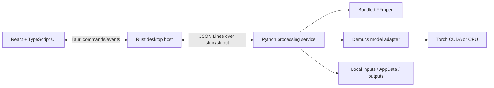

# Architecture

## Overview

SPLTR has three isolated layers:

The React layer owns interaction and presentation state. Rust owns the application window, per-user paths, dialog access, and the child-process lifetime. Python owns scanning, queue execution, decode, inference, output naming, and logs.

## IPC contract

The host starts `python.exe -u bootstrap.py`, writes one JSON command per line to stdin, and forwards each JSON event from stdout to a Tauri `backend-event`. Human-readable diagnostics go to stderr so they cannot corrupt IPC.

Commands include `configure`, `scan`, `ensure_model`, `start_queue`, `cancel_queue`, `delete_models`, `waveform`, `extract_video_audio`, `export_audio`, `export_video`, and `shutdown`. Events include `ready`, device changes, scan results, queue items, download state, waveform/extraction/export state, completion, and recoverable/fatal errors. Shared TypeScript types are in `src/types.ts`; backend parsing is deliberately tolerant so protocol fields can be added later.

Completed queue items expose their original path and paired stem output paths to the React result monitor. Tauri's scoped asset protocol lets the webview play these local files directly, while the `reveal_in_folder` command opens File Explorer with the selected output highlighted.

Waveforms are reduced to a compact high-density peak array by asking bundled FFmpeg for low-rate mono float PCM; full audio is never loaded into the React process. The editor stores a source range inside a fixed-duration output frame. Trimming adjusts the source range and converts the remaining frame space into leading or trailing silence; moving the output block only redistributes that silence, while moving the source strip changes the source range. Independent fade handles are constrained to the audible block.

The clip editor maintains an output-relative playhead separately from the source audio element's time. Audible output positions map to the selected source range, while silence positions have no source time. Preview uses a short UI interval during silence and the audio element during audible content, so the same clip playhead advances continuously across both regions and can start from any scrubbed position.

The output waveform is also the transport surface. A short click seeks, the playhead drags continuously, and a movement threshold distinguishes a click from moving the audio block. Fade duration is represented by diagonal envelopes whose endpoints are draggable over the same lane.

Audio export uses FFmpeg to create 24-bit WAV or 320 kbps MP3 clips. Video export combines the selected track with an 854×480 black color source. Both exporters trim the source first, apply independent fades, delay it by the leading-silence amount, pad it to the fixed output duration, and finally trim to that duration. The same timeline therefore produces matching WAV, MP3, and MP4 lengths. Exports follow the configured destination, use collision-safe names, and run on a background thread.

The video quick tool maps the first audio stream from a supported video container and writes 24-bit PCM WAV or 320 kbps MP3 through FFmpeg. It shares the configured output destination and collision-safe naming policy, and runs independently from Demucs without loading a model.

## First launch and installer size

CUDA Torch cannot fit in a 120 MB installer. SPLTR bundles the official Windows embeddable Python distribution and FFmpeg, then installs Torch, Torchaudio, and Demucs into AppData at first launch. GPU presence is checked with `nvidia-smi`: CUDA 12.1 wheels are selected for NVIDIA systems and CPU wheels otherwise. Models remain separate and are downloaded by Demucs into the AppData model cache.

This preserves the no-manual-Python requirement and keeps the installer small. It also means first launch needs enough disk space and can take several minutes.

## Processing flow

1. Scan dropped files and directories recursively using an extension allowlist.
2. Create collision-safe paired output paths.
3. Decode compressed/container formats to a temporary float WAV through bundled FFmpeg; WAV/FLAC can be read directly.
4. Normalize audio as expected by Demucs, run chunked inference, and select the vocals source.
5. Sum all non-vocal sources into the instrumental stem.
6. Write float WAV output, clear CUDA cache, and delete temporary audio.

The queue defaults to one model instance and sequential items to limit memory. Two-job mode uses separate model instances because Torch modules are not mutated across worker threads.

## Extensibility

`SeparationModel` is the stable backend interface. A future adapter can expose other stem layouts, noise removal, or enhancement without changing queue orchestration. Protocol additions should be backward-compatible. Six-stem output will require replacing the fixed `StemOutputs` pair with a named stem mapping; that is intentionally confined to the model/output boundary.

## Failure boundaries

Every file is an independent failure boundary. Known decode, missing-file, CUDA OOM, and output errors become safe queue messages. Unknown exceptions are logged and mark only that item failed. Model/runtime downloads have retryable overlay states. The Rust process terminates the Python child when the app window is destroyed.
